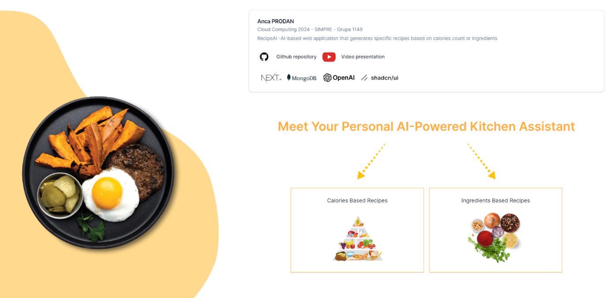
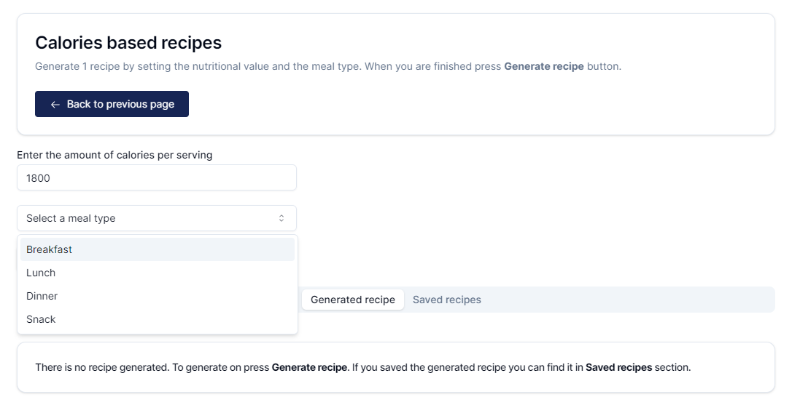
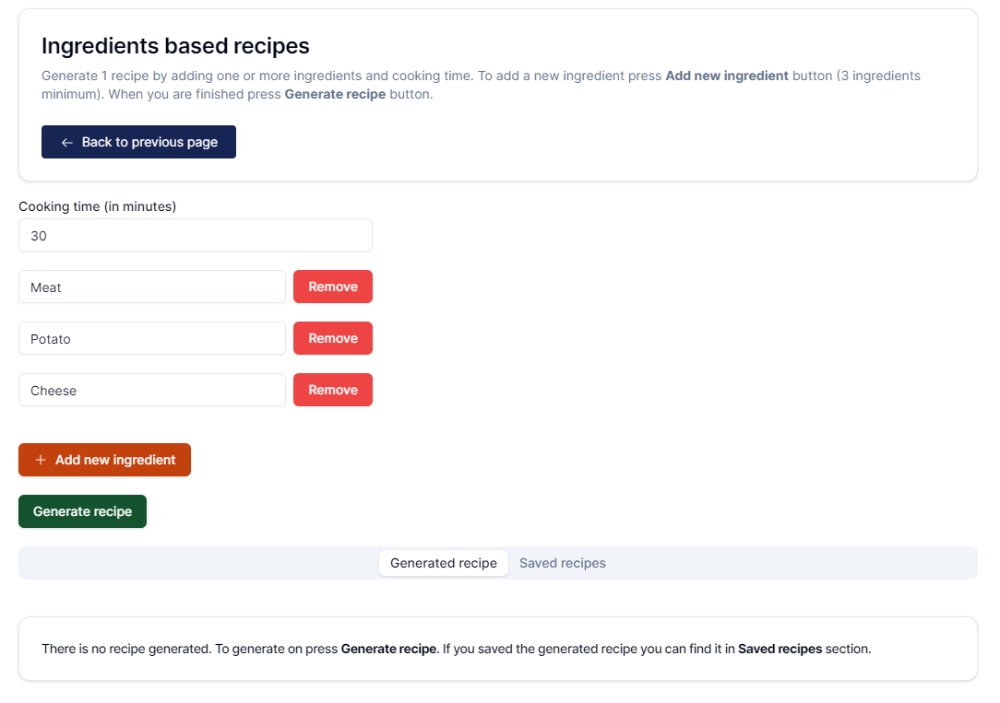
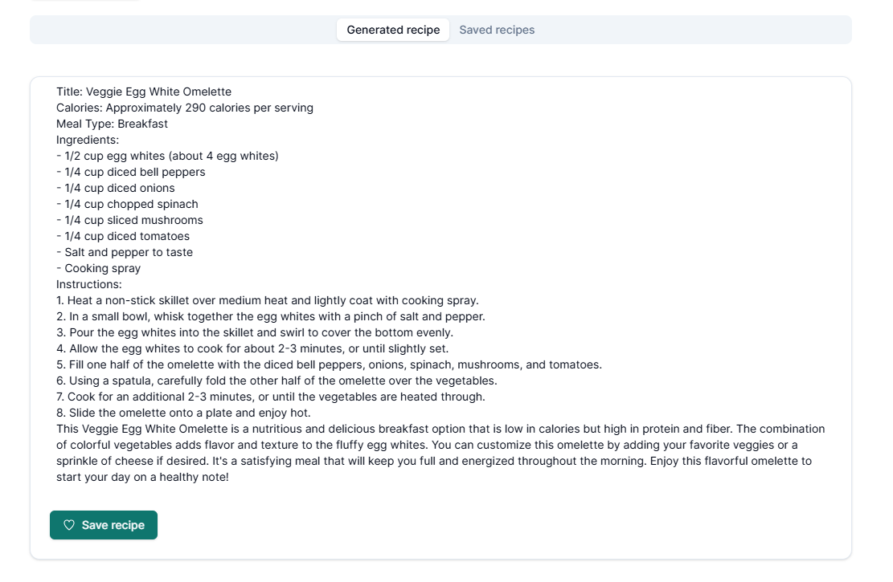
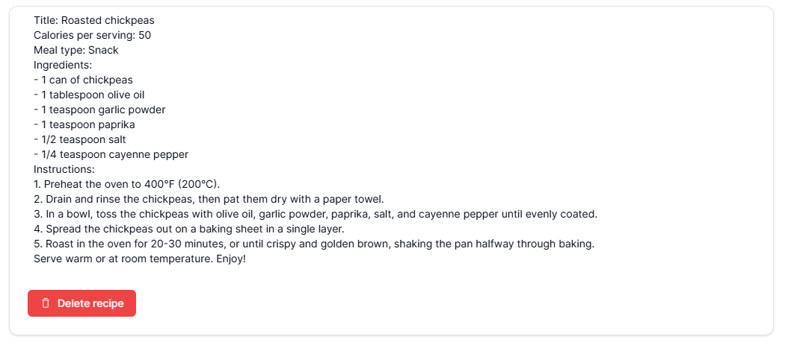
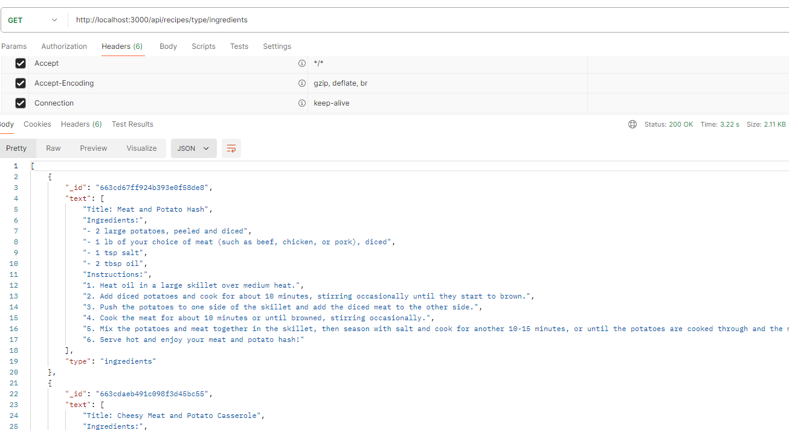

## Table of contents

- [RecipeAI](#recipeai)
  - [Descriere problema](#descriere-problema)
  - [Descriere API](#descriere-api)
    - [Rute](#rute)
    - [Testarea API-urilor](#testarea-api-urilor)
- [Live demo](#live-demo)
- [Technologies and libraries used](#technologies-and-libraries-used)
- [Getting Started](#getting-started)

## RecipeAI

<p>RecipeAI este o aplicatie web inovatoare bazata pe inteligenta artificiala, conceputa pentru a genera retete personalizate in functie de preferintele si nevoile utilizatorilor. Cu ajutorul tehnologiilor avansate de procesare a limbajului natural si de recunoastere a imaginilor, RecipeAI poate crea retete delicioase si sanatoase, adaptate in functie de doua criterii principale: numarul de calorii dorit sau o lista de trei ingrediente preferate.</p>
<p>Indiferent daca sunteti in cautarea unei optiuni cu un continut caloric specific sau aveti la dispozitie doar anumite ingrediente in bucatarie, RecipeAI va fi aliatul dumneavoastra de incredere in a descoperi si a experimenta noi preparate culinare. Cu o baza de date vasta de retete populare si un algoritm inteligent de recomandare, aplicatia va ofera sugestii inspirate pentru fiecare gust si preferinta.</p>
<p>Simplu de folosit si plin de resurse utile, RecipeAI este solutia ideala pentru cei pasionati de gatit sau pentru cei care doresc sa exploreze o paleta diversificata de mancaruri, adaptate nevoilor lor nutritionale. Descoperiti o noua dimensiune a bucatariei cu ajutorul RecipeAI - unde creativitatea culinara intalneste tehnologia de varf!</p>

<table>
  <tr>
    <td> </td>
    <td></td>
   </tr> 
   <tr>
      <td></td>
      <td></td>
  </tr>
  <tr>
    <td></td>
  </tr>
</table>

## Descriere problema
<p>In societatea moderna agitata si plina de diversitate culinara, gasirea retetelor potrivite si adaptate nevoilor individuale poate fi o provocare. Fie ca doriti sa urmati o dieta cu un anumit numar de calorii sau aveti la dispozitie anumite ingrediente in bucatarie, navigarea printre sutele de retete disponibile poate fi copleșitoare si consumatoare de timp.</p>
<p>RecipeAI abordeaza aceasta problema prin combinarea inteligentei artificiale cu domeniul culinar, oferind o solutie simpla si eficienta pentru generarea rapida si personalizata de retete. Prin utilizarea algoritmilor avansati de analiza a datelor si de procesare a limbajului natural, aplicatia poate interpreta preferintele utilizatorului si genera propuneri de preparate culinare perfect adaptate cerintelor sale.</p>
<p>Indiferent daca sunteti in cautarea unei retete cu un anumit numar de calorii sau doriti sa va folositi de ingredientele disponibile in bucatarie pentru a pregati ceva delicios, RecipeAI va ofera solutia ideala pentru a satisface pofta de experimentare si descoperire gastronomica. Cu beneficii precum economisirea timpului si diversificarea alimentatiei, aplicatia web RecipeAI este raspunsul modern la provocarile legate de gasirea retetelor personalizate si atragatoare.</p>

## Descriere API
<h4>Configurarea API-ului NextJS</h4>
<p>Pentru Autentificare si autorizarea serviciilor utilizate se folosesc chei de mediu:</p>

```bash
NODE_ENV = development
NEXT_ATLAS_URI = MONGODB_CONNECTION_STRING
NEXT_ATLAS_DATABASE = MONGODB_DATABASE_NAME
OPENAI_API_KEY=OPENAI_API_KEY
```

## Rute
<ul>
  <li>/api/recipes - accepta metoda POST. Acest endpoint este folosit pentru salvarea unei retete generate de ChatGPT in baza de date</li>
  <li>/api/recipes/[recipeID] - accepta metodele DELETE si GET. Acest endpoint este folosit pentru stergerea sau cautarea in baza de date a unei retete</li>
  <li>/api/recipes/type/[type] - accepta metoda GET. Acest endpoint este folosit pentru a returna din baza de date toate retetele de un anumit tip (`ingredients` sau `calories`)</li>
  <li>/api/openai - accepta metoda POST. Acest endpoint este folosit pentru generarea unei retete folosind ChatGPT.</li>
</ul>

## Testarea API-urilor

<h3>Folosind POSTMAN</h3>
<p>
  
</p>

<ul>
  <li><b>http://localhost:3000/api/recipes/type/ingredients</b></li>
  <li><b>http://localhost:3000/api/recipes/</b> - POST
    <div>
      ```bash
    
      Request body JSON format : 
      {
        text: string[],
        type: string
      }
      ```
    </div>
  </li>
</ul>


## Live demo

[See live demo](https://recipe-ai-dusky.vercel.app/).

## Technologies and libraries used

- NodeJS
- NextJS 14
- MongoDB Cloud
- OpenAI
- TailwindCSS
- shadcn/ui

## Getting Started

For using MongoDB Cloud and OpenAI add the following keys to `.env` file :


First, run the development server::

```bash
npm run dev
# or
yarn dev
# or
pnpm dev
# or
bun dev
```

Open [http://localhost:3000](http://localhost:3000) with your browser to see the result.

This project uses [`next/font`](https://nextjs.org/docs/basic-features/font-optimization) to automatically optimize and load Inter, a custom Google Font.
